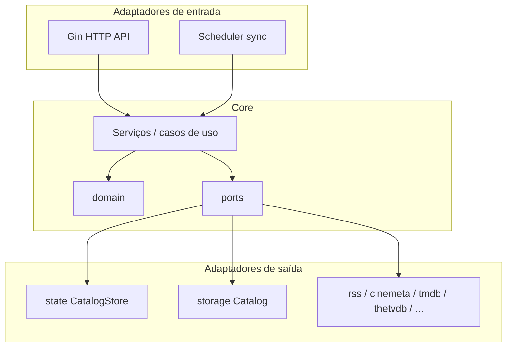
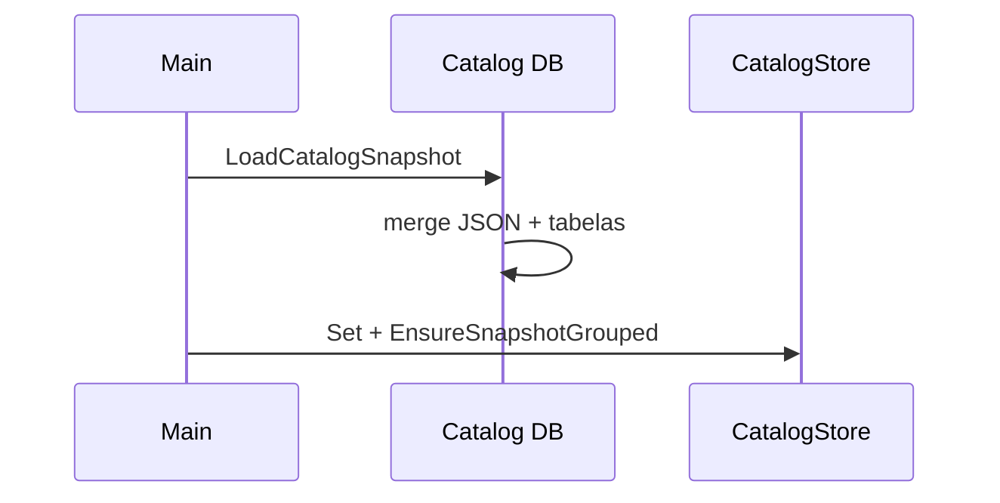

# GoAnimes — Arquitetura

Documento de desenho: organização em **hexagonal (ports & adapters)**, persistência e fluxos principais. Alinha-se à ideia de [GoVC — Hexagonal Architecture](https://github.com/wallissonmarinho/GoVC/blob/master/HEXAGONAL_ARCHITECTURE.md).

## Visão em camadas



- Domain — entidades e regras puras (catálogo, merge, IDs Stremio, enriquecimento de séries, etc.); sem SQL, sem HTTP.
- Ports — contratos (`CatalogRepository`, `CatalogAdmin`, `SyncRunner`, `UnitOfWork`, `SynopsisTranslator`, …).
- Casos de uso — pacotes `rsssync` (sync RSS + enriquecimento), `stremio` (resposta Stremio e lazy meta), `services` (admin de catálogo, tradução de sinopse, helpers TMDB partilhados).
- Adapters — Gin, SQLite/Postgres, clientes RSS e APIs externas, estado em memória.

## Estrutura de pastas (atual)

```
cmd/goanimes/          # bootstrap, wiring mínimo
internal/
  app/                 # composição (OpenCatalog, HydrateCatalogStore, NewRSSSyncService, …)
  core/
    domain/            # CatalogSnapshot, CatalogItem, SeriesEnrichment, …
    ports/             # interfaces (um ficheiro por contrato quando possível)
    rsssync/           # RSS sync + enriquecimento Cinemeta/TMDB/TheTVDB/…
    stremio/           # meta/stream Stremio (lazy enrich, helpers de resposta)
    services/          # catalog admin, tradução sinopse/títulos, TMDB hero helpers, …
  adapters/
    http/ginapi/       # rotas Stremio + admin + middleware
    storage/           # Catalog, catalogRepo, persistência SQL + normalizado
    state/             # CatalogStore (snapshot em RAM)
    rss/               # parse feeds Erai, etc.
    cinemeta/, tmdb/, thetvdb/, translate/, …
  persistence/migrate/ # Goose
migrations/            # postgres/, sqlite/
```

Roadmap — curadoria por série via IA (revisão de título raiz, temporadas, season/episode por release) sobre catálogo relacional + `series_enrichment` + `series_curation`; contrato da API e endpoint em fase posterior.

## Dados persistidos

### Tabelas principais

| Tabela | Papel |
|--------|--------|
| `rss_sources` | URLs dos feeds RSS configurados |
| `catalog_snapshot` | Linha única (`id=1`): `items_json` (payload JSON), flags de sync, contagens, timestamps |
| `catalog_series` | Séries normalizadas (id estável Stremio, nome, poster, descrição, géneros, releaseInfo) |
| `catalog_item` | Episódios/releases com `series_id` → `catalog_series` (FK, CASCADE) |
| `series_enrichment` | Metadados de enriquecimento por série (1:1 com `catalog_series`); mapas de episódio em `episode_maps_json` |
| `series_curation` | Estado de revisão IA por série (esquema preparado; use case e HTTP por implementar) |

### Payload JSON (`items_json`)

Inclui tipicamente:

- `items` — lista de `CatalogItem` (espelhada em `catalog_item` após sync).
- `anilist_series` — chave legada de payload (mantida por compatibilidade de leitura); omitida quando existem linhas em `series_enrichment`.
- `rss_main_feed_build` — fingerprint por URL de feed principal (`sha256` do corpo + `etag` / `last_modified`) para o poll RSS.
- `last_sync_errors` — notas do último sync.

### Transações (Unit of Work)

- `Catalog.SaveCatalogSnapshot` abre uma transação: substitui `catalog_series` + `catalog_item` + `series_enrichment` (via replace) e grava `items_json` de forma atómica.
- `ports.UnitOfWork` / `Catalog.WithinCatalogTx` permite outros blocos multi-passo no mesmo `sql.Tx` (repositório transacional exposto como `CatalogRepository`).

### Hidratação ao arranque

1. `LoadCatalogSnapshot` lê a linha `catalog_snapshot` e faz unmarshal do JSON.
2. Se existirem linhas em `catalog_item`, itens e séries vêm das tabelas normalizadas; enriquecimento vem de `series_enrichment` quando a tabela tem dados, senão do JSON (`anilist_series`) com backfill automático para SQL quando aplicável.
3. Se as tabelas normalizadas estiverem vazias mas o JSON tiver itens, corre backfill do catálogo normalizado numa transação.



## Fluxos principais

### Sync RSS

1. `SyncRunner.Run` (implementação em `rsssync`) lista `rss_sources`, obtém feeds, merge com catálogo anterior, enriquecimento opcional (Cinemeta, TMDB, TheTVDB, traduções).
2. Atualiza `CatalogStore` em memória e persiste via `CatalogRepository.SaveCatalogSnapshot` (transação com SQL normalizado + JSON).

### Stremio (catálogo / meta / streams)

1. Handlers Gin finos em `ginapi`; lazy enrich em `internal/core/stremio/stremio_lazy_enrich.go`; montagem de payloads em `internal/core/stremio/stremio_response.go`.
2. Leitura do catálogo via `CatalogAdmin` → `CatalogStore.Snapshot()` (RAM), enriquecimento lazy pode alterar memória e chamar `PersistActiveCatalog`.

### Poll RSS (`RSSMainFeedsChanged`)

- Compara feeds principais com fingerprints guardados (hoje em `rss_main_feed_build` no JSON); não cobre só mudanças em feeds Erai por-anime se o feed global não mudar.

## Princípios a manter

1. Handlers sem SQL — só HTTP e chamadas a ports / serviços.
2. Domain sem I/O — facilita testes e evolução.
3. Interfaces nas fronteiras — substituir SQLite por Postgres (ou mocks) sem mudar casos de uso.
4. Escritas multi-tabela numa transação — evitar catálogo inconsistente a meio.

## Referências no repositório

- Ports: [`internal/core/ports/`](../internal/core/ports/)
- Snapshot e tipos: [`internal/core/domain/catalog_snapshot.go`](../internal/core/domain/catalog_snapshot.go), [`series_enrichment.go`](../internal/core/domain/series_enrichment.go)
- Persistência: [`internal/adapters/storage/catalog.go`](../internal/adapters/storage/catalog.go), [`catalog_repo.go`](../internal/adapters/storage/catalog_repo.go), [`catalog_repo_normalized.go`](../internal/adapters/storage/catalog_repo_normalized.go), [`catalog_repo_enrichment.go`](../internal/adapters/storage/catalog_repo_enrichment.go)
- Wiring: [`internal/app/wiring.go`](../internal/app/wiring.go)

---

*Última atualização: alinhado ao desenho de evolução (enrichment relacional + pacotes por feature) documentado no plano interno do projeto.*
